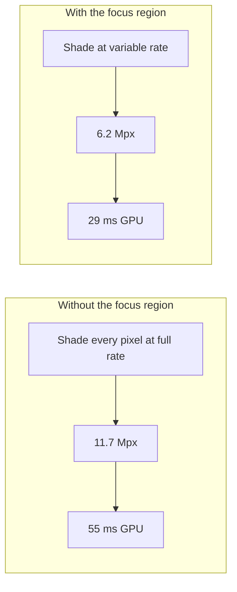
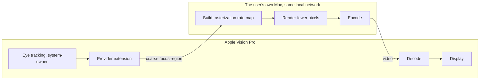

# Focused Rendering

Gaze-driven foveated **rendering** on a Mac, streamed to Apple Vision Pro.

## Purpose

Apple Vision Pro knows where the wearer is looking. A Mac rendering content for
it does not, so it shades every pixel at full rate — including the periphery,
where the eye cannot resolve the detail.

Focused Rendering closes that loop. The headset's focus region drives a Metal
rasterization rate map on the Mac, so the Mac's GPU shades fewer pixels where
they cannot be seen. This is foveated rendering, not foveated compression: the
saving happens before a frame exists, in the renderer.

It is an independent, open-source project by a single developer, built against
Apple's published Foveated Streaming documentation.



## Measured

Real GPU time on an Apple M2 Pro, rendering a fragment-bound raymarched scene at
3660×3200 — Apple Vision Pro's per-eye resolution. `fr-bench` reproduces this.

| Profile | Pixels shaded | GPU time | Saved |
|---|---|---|---|
| off (baseline) | 11.7 Mpx | 55.3 ms | — |
| conservative | 8.9 Mpx | 42.1 ms | 24% |
| balanced | 7.6 Mpx | 35.4 ms | 36% |
| aggressive | 6.2 Mpx | 29.0 ms | 48% |
| extreme | 5.4 Mpx | 25.4 ms | 54% |

The saving holds steady across a 3× sweep of shader cost, so it is driven by
pixel count rather than by one scene's particulars. This is an upper bound:
fully fragment-bound work benefits most, while vertex, geometry and draw-call
cost does not shrink.

## What it costs in quality

`fr-pipeline` renders the same frame at full rate and through the rate map,
inverts the warp, and compares them.

| Profile | Fovea | Worst 128px tile |
|---|---|---|
| conservative | 86.0 dB | 38.9 dB |
| balanced | 91.4 dB | 35.0 dB |
| aggressive | 100.4 dB | 35.3 dB |
| extreme | lossless | 35.2 dB |

The fovea reconstructs essentially exactly, which is what confirms the inverse
warp is right rather than merely plausible. Worst-case peripheral quality then
sits around 35 dB and barely moves between profiles, while the GPU saving more
than doubles across the same range — so the aggressive end of the scale buys a
lot for very little.

Averages are reported per tile rather than over the whole periphery on purpose:
most of a frame is background that undersampling leaves untouched, and a
peripheral mean stays near 49 dB even where detail has been destroyed.

## Under a bitrate budget

Rendering fewer pixels also means encoding fewer pixels. `fr-pipeline --bitrate`
puts both paths through real-time HEVC at the same ceiling and compares the
decoded, unwarped result against a full-rate reference.

At 4 Mbps — a constrained wireless link, which is the case that matters:

| Path | Fovea | Worst tile | Encode | Decode |
|---|---|---|---|---|
| full rate | 42.1 dB | 30.2 dB | 28.2 ms | 9.3 ms |
| aggressive foveation | **52.8 dB** | **35.6 dB** | **17.4 ms** | **6.2 ms** |

Foveation wins everywhere, not just where the eye is pointed. Spreading a small
bit budget across 11.7 Mpx degrades the whole frame; spending it on 6.2 Mpx
leaves enough for the fovea to stay at its rendering ceiling, and the periphery
still comes out ahead.

The gap widens as bandwidth tightens — 10.7 dB in the fovea at 4 Mbps, 12.6 dB
at 2 Mbps — and closes when bandwidth is plentiful. At 50 Mbps the encoder is
never the constraint and both paths land near their rendering quality, though
the foveated path still encodes in 18 ms against 29 and decodes in 6 ms against
9. That decode figure is spent on the headset, where the headroom is tightest.

## How it works



The Mac advertises itself over Bonjour as `_apple-foveated-streaming._tcp` and
completes the session-management handshake and QR pairing. Once streaming, the
provider extension quantizes the focus region and passes it to the Mac, which
centres its rate map there for the next frame.

## Privacy

Both endpoints are devices the user already owns, talking directly to each other
over the user's own local network.

- **No third party.** No server, no cloud relay, no analytics endpoint. This
  project operates no infrastructure, and makes no outbound connection other
  than the direct peer-to-peer link to the paired headset.
- **No accounts, no telemetry, no crash reporting, no identifiers.**
- **The focus region never leaves the streaming session.** It steers the rate
  map and the encoder, nothing else. It is never exposed to any other
  application, never written to disk, never logged, and discarded once the frame
  it steered has been rendered.
- **Only a coarse region crosses the link**, quantized to the rate map's cell
  grid — not raw gaze vectors, and not at a fidelity that would reconstruct
  them.
- **Pairing is explicit and mutual.** A session requires a QR code scanned on
  the headset, and the endpoint is reachable only on the local network.
- **Auditable.** The source is public. Every claim above is verifiable by
  reading it rather than taken on trust.

## Entitlement

Reading the focus region requires `com.apple.developer.foveated-streaming-provider`,
which is what this project is requesting.

To be explicit about the scope: the built-in provider uses the focus region to
steer video encoding. This project also uses it to steer rasterization on the
host, which is where the measured savings above come from. Both stay inside the
streaming session, and neither surfaces the data to anything else.

The session-management protocol, pairing and the rate-map renderer are already
implemented and tested without the entitlement.

## Status

| Milestone | Scope | State |
|---|---|---|
| M0 | Discovery, pairing handshake, session state | **complete** |
| M1 | Rate-map renderer and GPU measurement | **complete** |
| M2 | Inverse warp and quality measurement | **complete** |
| M3 | Real-time HEVC through the loop, measured | **complete** |
| M4 | Media protocol, transport and the streaming loop | **complete** |
| M5 | visionOS client and on-device display | next |
| M6 | Driven by the focus region | requires the entitlement |

The client substitutes head pose for gaze, so the whole pipeline can be
validated before the entitlement exists. The focus point already travels on the
media channel; only its source changes.

The host currently manages 17.4 fps at 3660×3200 because rendering and encoding
do not overlap, and 49 ms of latency before the network. Both are addressed by
pipelining the loop, which is the next piece of work after the client.

## Building

```
swift build
swift test

fr-bench                                      # GPU time by profile
fr-pipeline --out ./frames                    # quality, with PNGs to inspect
fr-pipeline --bitrate 4                       # the same, through real-time HEVC
fr-host --bundle-id <id> --stream             # the streaming endpoint
fr-probe --sweep                              # a stand-in headset, for measuring
```

Requires macOS 14 or later and an Apple silicon Mac. Engineering notes, protocol
details and open questions are in [NOTES.md](NOTES.md).

## License

MIT
