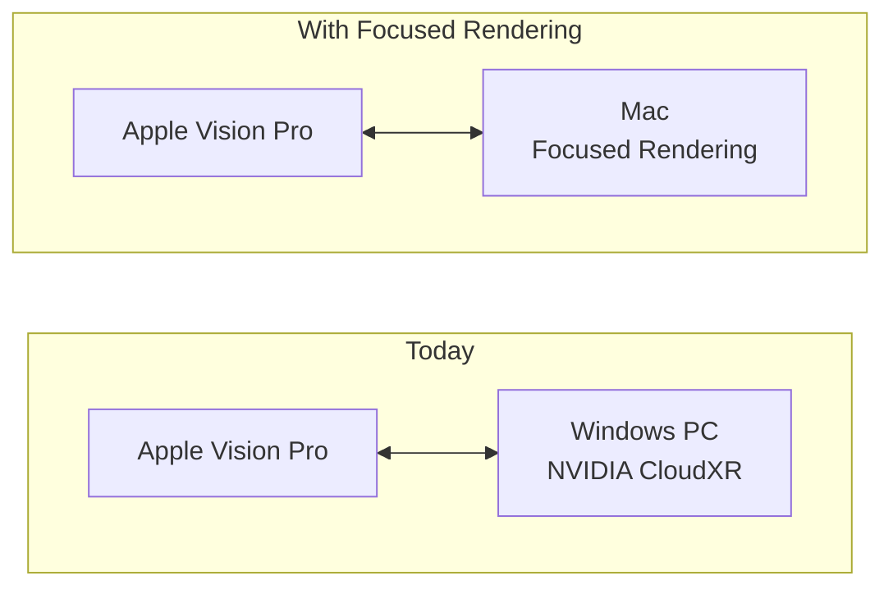
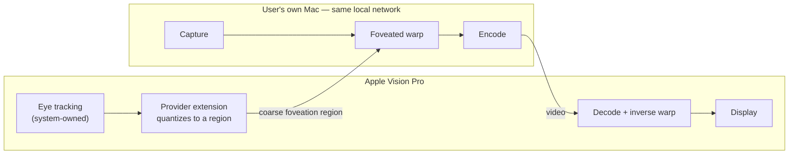

# Focused Rendering

A macOS streaming endpoint for Apple's Foveated Streaming protocol.

## Purpose

Foveated streaming to Apple Vision Pro currently requires a Windows PC running
NVIDIA CloudXR, which is the only streaming provider built into visionOS.

Focused Rendering implements the Foveated Streaming Protocol on macOS, so a Mac
can act as the streaming endpoint for an Apple Vision Pro on the same local
network. It is an independent, open-source project developed by a single
developer, built directly against Apple's published protocol documentation.



## How it works

The Mac advertises itself over Bonjour as `_apple-foveated-streaming._tcp`,
completes the session-management handshake and QR pairing, then captures,
foveates and encodes frames for the headset. The headset decodes each frame and
inverts the foveation warp before display.



Concentrating detail where the user is looking means fewer pixels are encoded
and transmitted, which raises image quality at a given bitrate and lowers
latency.

## Privacy

Both endpoints are devices the user already owns, talking directly to each other
over the user's own local network.

- **No third party.** There is no server, no cloud relay and no analytics
  endpoint. This project operates no infrastructure of any kind, and the
  software makes no outbound connection other than the direct peer-to-peer link
  to the paired headset.
- **No accounts, no telemetry, no crash reporting, no identifiers.**
- **Foveation data never leaves the streaming session.** The focus region is
  used solely to steer the encoder. It is never exposed to the application whose
  content is being streamed, never written to disk, never logged, and discarded
  as soon as the frame it steered has been encoded.
- **Only a coarse region crosses the link**, quantized to encoder block
  granularity — not raw gaze vectors, and not at a fidelity that would
  reconstruct them.
- **Pairing is explicit and mutual.** A session requires a QR code scanned on
  the headset, and the endpoint is reachable only on the local network.
- **Auditable.** The source is public. Every claim above is verifiable by
  reading it rather than taken on trust.

## Entitlement

Reading the focus region requires `com.apple.developer.foveated-streaming-provider`,
which is what this project is requesting. It would be used for one purpose:
steering the video encoder within the streaming session, exactly as the
entitlement is documented to allow.

The session-management protocol, pairing and transport are already implemented
and tested without it.

## Status

| Milestone | Scope | State |
|---|---|---|
| M0 | Discovery, pairing handshake, session state | **complete** |
| M1 | Capture, encode, transport, display | in progress |
| M2 | Foveated warp and inverse warp | planned |
| M3 | Focus-region-driven foveation | requires the entitlement |

M0 is covered by 26 tests, including conformance against the byte sequences and
message formats in Apple's protocol documentation.

## Building

```
swift build
swift test
.build/debug/fr-host --bundle-id <visionOS app bundle ID>
```

Requires macOS 14 or later. Engineering notes, protocol details and open
questions are in [NOTES.md](NOTES.md).

## License

MIT
