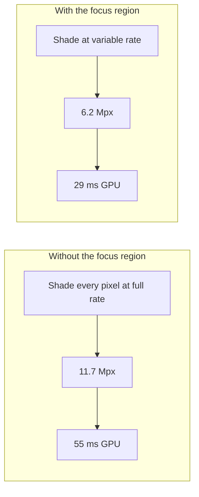
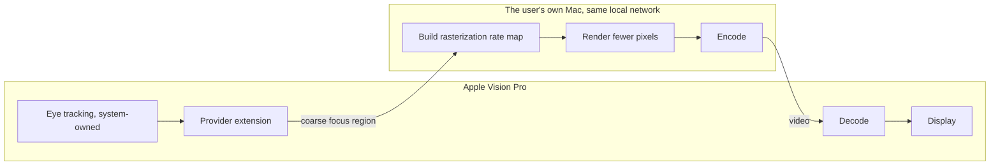

# Focused Rendering

Gaze-driven foveated **rendering** on a Mac, streamed to Apple Vision Pro.

**Status: alpha.** The host pipeline is built and measured. Device testing has
not started; every figure below is measured on the host and reproducible from
this repository.

## Purpose

This project exists for efficiency.

Apple Vision Pro knows where the wearer is looking. A Mac rendering content for
it does not, so it shades every pixel at full rate — including the periphery,
where the eye cannot resolve the detail, and then spends bits encoding that
detail and decoder time unpacking it again.

Focused Rendering closes that loop. The headset's focus region drives a Metal
rasterization rate map on the Mac, so fewer pixels are shaded, fewer are
encoded, and fewer reach the headset's decoder. The saving happens before a
frame exists, in the renderer — this is foveated rendering, not foveated
compression.

It is an independent, open-source project by a single developer, built against
Apple's published Foveated Streaming documentation.



## What has been measured

All figures: Apple M2 Pro, 3660×3200 (Apple Vision Pro per-eye resolution),
`aggressive` profile, against a full-rate reference. Reproduce with `fr-bench`,
`fr-pipeline` and `fr-probe`.

**GPU time.** Shading fewer pixels, which is the point of the whole exercise.

| Profile | Pixels shaded | GPU time | Saved |
|---|---|---|---|
| off (baseline) | 11.7 Mpx | 55.3 ms | — |
| conservative | 8.9 Mpx | 42.1 ms | 24% |
| balanced | 7.6 Mpx | 35.4 ms | 36% |
| aggressive | 6.2 Mpx | 29.0 ms | **48%** |
| extreme | 5.4 Mpx | 25.4 ms | 54% |

The saving holds within a percentage point across a 3× sweep of shader cost, so
it is a property of the rate map rather than of one scene.

**Reconstruction quality.** The foveated frame is unwarped and compared to the
full-rate reference.

| Profile | Fovea | Worst 128px tile |
|---|---|---|
| conservative | 86.0 dB | 38.9 dB |
| balanced | 91.4 dB | 35.0 dB |
| aggressive | 100.4 dB | 35.3 dB |
| extreme | lossless | 35.2 dB |

The fovea reconstructs essentially exactly. Worst-case peripheral quality sits
around 35 dB and barely moves between profiles, while the GPU saving more than
doubles across the same range.

**Under a bitrate budget.** Both paths through real-time HEVC at 4 Mbps — a
constrained wireless link, which is the case that matters.

| Path | Fovea | Worst tile | Encode | Decode |
|---|---|---|---|---|
| full rate | 42.1 dB | 30.2 dB | 28.2 ms | 9.3 ms |
| aggressive foveation | **52.8 dB** | **35.6 dB** | **17.4 ms** | **6.2 ms** |

Foveation wins everywhere, not only where the eye is pointed: spreading a small
bit budget across 11.7 Mpx degrades the whole frame, while 6.2 Mpx leaves enough
for the fovea to stay at its rendering ceiling. The gap widens as the link
tightens — 10.7 dB in the fovea at 4 Mbps, 12.6 dB at 2 Mbps.

The decode figure is the one spent on the headset, where the headroom is
tightest: 6.2 ms against 9.3 ms per frame.

**End to end.** Host render through encode to client arrival, measured over a
real socket with a moving focus point.

| | serial loop | overlapped |
|---|---|---|
| throughput | 17.4 fps | **49.4 fps** |
| latency, median | 49.2 ms | **40.7 ms** |
| latency, p95 | 69.0 ms | **42.1 ms** |

Rendering and encoding overlap, so throughput is the larger of the two stages
rather than their sum. The remaining latency is one frame's trip through both.

## Expected gains on device

Nothing here has run on hardware yet, so these are projections from the figures
above rather than results:

- **GPU:** roughly half the shading cost at the aggressive profile, which is
  what allows a higher render resolution or a more expensive scene within the
  same frame budget.
- **Bandwidth:** materially better image quality at a fixed bitrate, or the same
  quality on a tighter link. On a congested network this is the difference
  between a usable stream and an unusable one.
- **Headset decode:** about a third less decode time per frame, on the device
  with the least thermal and power headroom in the chain.

The honest caveats: the benchmark scene is entirely fragment-bound, so it
represents an upper bound — vertex, geometry and draw-call cost does not shrink.
And perceptual quality in the periphery is ultimately a question hardware has to
answer, not PSNR.

## How it works



The Mac advertises itself over Bonjour as `_apple-foveated-streaming._tcp` and
completes the session-management handshake and QR pairing. Once streaming, the
provider extension quantizes the focus region and passes it to the Mac, which
centres its rate map there for the next frame.

## Privacy

Both endpoints are devices the user already owns, talking directly to each other
over the user's own local network.

- **No third party.** No server, no cloud relay, no analytics endpoint. This
  project operates no infrastructure, and makes no outbound connection other
  than the direct peer-to-peer link to the paired headset.
- **No accounts, no telemetry, no crash reporting, no identifiers.**
- **The focus region never leaves the streaming session.** It steers the rate
  map and the encoder, nothing else. It is never exposed to any other
  application, never written to disk, never logged, and discarded once the frame
  it steered has been rendered.
- **Only a coarse region crosses the link**, quantized to the rate map's 32×32
  cell grid — not raw gaze vectors, and not at a fidelity that would reconstruct
  them.
- **Pairing is explicit and mutual.** A session requires a QR code scanned on
  the headset, and the endpoint is reachable only on the local network.
- **Auditable.** The source is public. Every claim above is verifiable by
  reading it rather than taken on trust.

## Entitlement

Reading the focus region requires `com.apple.developer.foveated-streaming-provider`,
which is what this project is requesting.

To be explicit about the scope: the built-in provider uses the focus region to
steer video encoding. This project also uses it to steer rasterization on the
host, which is where the GPU savings above come from. Both stay inside the
streaming session, and neither surfaces the data to anything else.

Everything that does not require the entitlement is already built and tested:
the session-management protocol, pairing, the media transport, the rate-map
renderer, the inverse warp, and the measurement tools. In testing the focus
point is derived from head pose via ARKit, which validates the pipeline but not
the perceptual result — the eye moves independently of the head, so head pose
points at the right place only for large movements.

## Development status

Alpha. Verified by 61 automated tests, including protocol conformance against
the byte sequences in Apple's documentation, and end-to-end streaming over real
sockets.

| Milestone | Scope | State |
|---|---|---|
| Session management | Discovery, pairing handshake, session state | complete |
| Rate-map renderer | Variable-rate rendering and GPU measurement | complete |
| Inverse warp | Reconstruction and quality measurement | complete |
| Codec | Real-time HEVC through the loop | complete |
| Transport | Media protocol and the streaming loop | complete |
| visionOS client | Decode, unwarp and display on device | in progress |
| Focus region | Driven by real gaze | requires the entitlement |

## Building

```
swift build
swift test

fr-bench                                      # GPU time by profile
fr-pipeline --out ./frames                    # quality, with PNGs to inspect
fr-pipeline --bitrate 4                       # the same, through real-time HEVC
fr-host --bundle-id <id> --stream             # the streaming endpoint
fr-probe --sweep                              # a stand-in headset, for measuring
```

Requires macOS 14 or later and an Apple silicon Mac. Engineering notes, protocol
details and open questions are in [NOTES.md](NOTES.md).

## License

MIT
